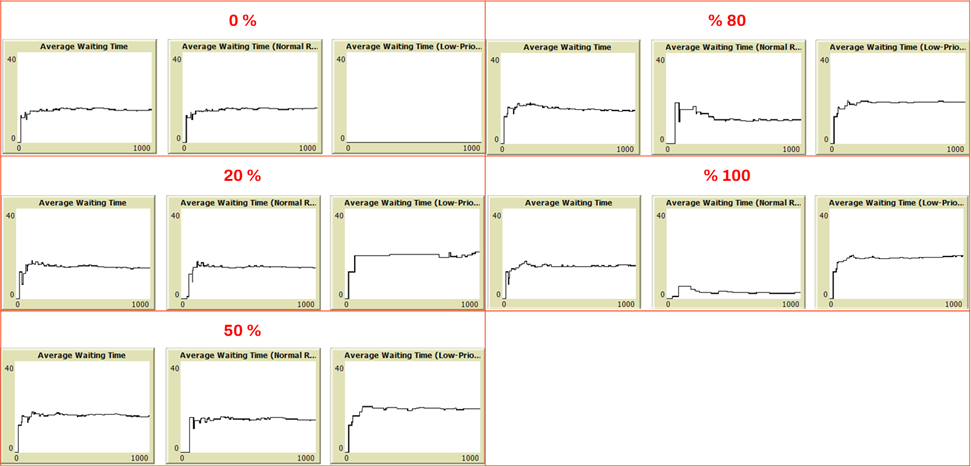

# Optimizing Patient Flow: An Agent-Based Heart Center Simulation

**Computer Simulation of Healthcare Systems Final Project, January 2025**  
Department of Industrial and Systems Engineering, Tarbiat Modares University

**Professor:** Dr. Yavari  

**Students:** Matineh Rangzan, Faezeh Zare, Paria Sadeghi

## Project Overview
This project focuses on simulating patient management in a heart center to address challenges in balancing patient care for critical and non-critical patients. Using NetLogo, we evaluated the impact of introducing a low-priority room on patient waiting times and death rates.

## Objectives
- Analyze the current patient management system.
- Propose and simulate a model with an additional low-priority room for non-critical patients.
- Evaluate the impact on key metrics such as average waiting time and patient mortality.

## Models
### 1. Current Model
In the current system, both critical and non-critical patients share the same facilities, leading to competition for resources and extended waiting times for critical patients. The flow includes:
- Entry
- Doctor's Office
- CCU
- Waiting Room
- Discharge

### 2. Proposed Model
The proposed system introduces a **Low-Priority Room** for non-critical patients. This change aims to:
- Reduce pressure on critical facilities.
- Improve resource allocation and patient flow.
- Minimize waiting times and mortality rates.

**Key Changes:**
- Non-critical patients are allocated to the low-priority room based on a percentage slider (0% to 100%).
- Critical patients are prioritized for key facilities like the CCU.

## Simulation Details
### Environment Setup
- **Room Types:**
  - Waiting Room (Green): For critical patients and some non-critical patients.
  - Doctor's Office (Red): For treatment.
  - CCU (Blue): For critical care.
  - Low-Priority Room (Yellow): For non-critical patients.

  

- **Patient Types:**
  - Critical (Black): 30%
  - Non-Critical (White): 70%

  

  - **Agents' Attributes**:

  
  

### Key Parameters
- **Doctor's Office Capacity:** 1 patient.
- **CCU Capacity:** 12 patients.
- **Maximum Waiting Time (Critical Patients):** 10 ticks before death.
- **Slider for Non-Critical Allocation:** 0% to 100% allocation to the low-priority room.

### Scenarios

### Outputs
- Average waiting time (overall, normal room, low-priority room).
- Death rates over time.

## Results
- Optimal performance occurred at **50% allocation** of non-critical patients to the low-priority room.
- Adding the low-priority room:
  - Significantly reduced waiting times for both critical and non-critical patients.

    

  - Lowered death rates by improving access for critical patients.
  
    

## Simulation in Action
Below is a snapshot of the simulation interface in NetLogo, showing the environment setup, sliders, and output metrics.

## How to Run the Simulation
1. Open `Heart-Center-Simulation.nlogo` in NetLogo.
2. Use the slider to set the percentage of non-critical patients allocated to the low-priority room.
3. Run the simulation and observe key metrics, including waiting times and death rates.

## Key Findings
- Adding a low-priority room improves the system's efficiency and reduces patient mortality.
- Balancing allocation (e.g., 50% non-critical patients to the low-priority room) optimizes resource usage and patient outcomes.
